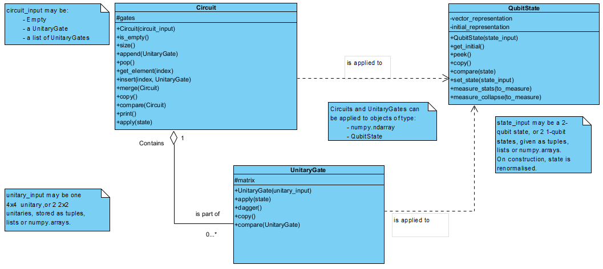

.. DrMD documentation master file, created by
   sphinx-quickstart on Sat Nov 30 16:46:44 2024.
   You can adapt this file completely to your liking, but it should at least
   contain the root `toctree` directive.

Welcome to DrMD's documentation!
===============================

DrMD is a python package designed for performing gate operations on two-qubit states.
This package allows for the creation of custom unitary gates, intialisation of 
two-qubit states, application of unitary gates on specified states and grouping 
of unitaries together in circuits.

To install the package, please follow the instructions in the README. If you'd like 
more information about how this package can be used, please look at the helpful
tutorial notebook which runs through all the core features of the DrMD package!

The graph below outlines the overall structure of the package:

.. toctree::
   :maxdepth: 2
   :caption: Contents:

   modules
   notebooks/tutorial_notebook
